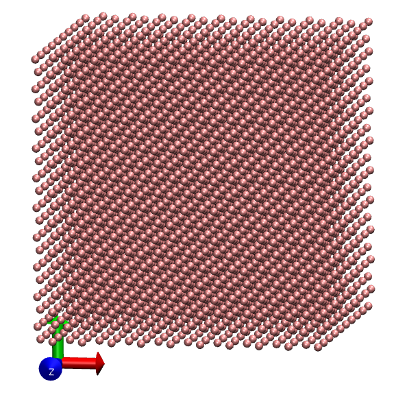
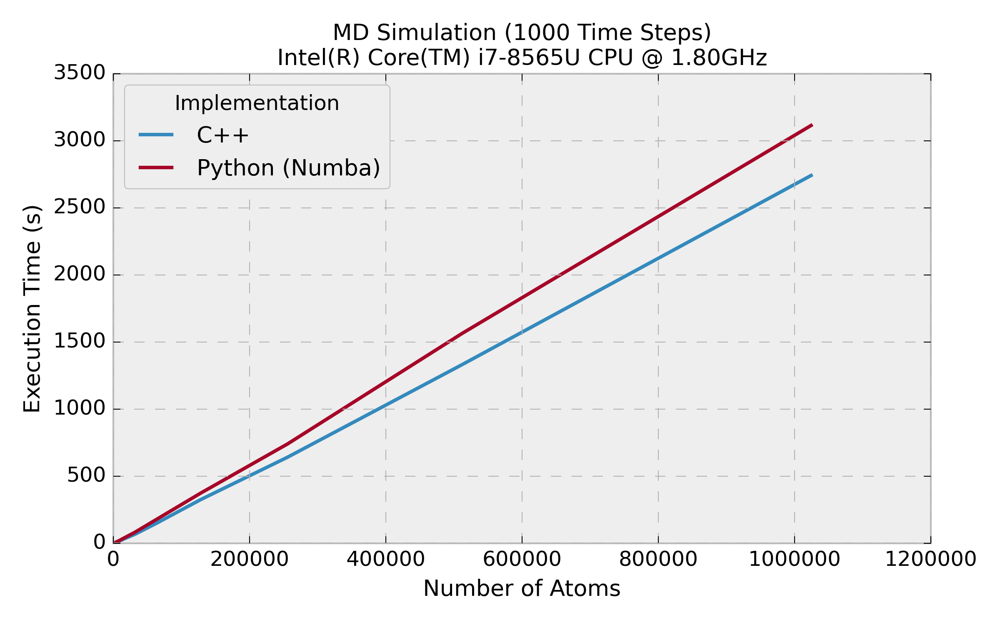
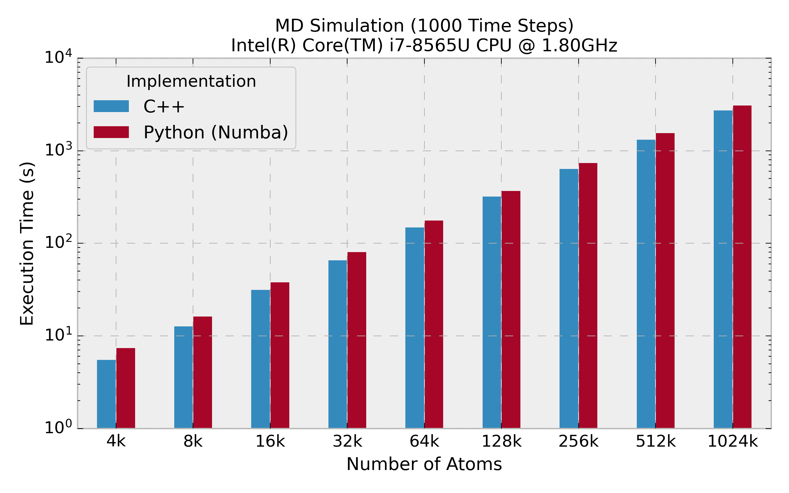

# Linear MD

This repository shows my attempts on implementing a *linear-scaling* molecular dynamics (MD) simulation.
The main focus is on improving performance using **cell list** and **neighbor list** methods, in comparison to my previous [simple MD](https://github.com/hghcomphys/simulational-physics/tree/master/simple_md) implementation. 
These techniques reduce the computational complexity of force calculations from *O(N²)* to approximately *O(N)* for short-range interactions, where *N* is the number of atoms in the system.

Additionally, it showcases that a Python implementation using the [Numba](https://numba.pydata.org/) compiler is a powerful alternative to C++ for scientific computing, offering a more efficient and productive development experience without compromising performance.

An example MD system with 4000 Argon atoms.




## Repository Structure

- `md.cpp` — C++ molecular dynamics implementation
- `md.py` — Python (Numba) implementation
- `generate_lattice.py` — Creating initial configuration 
- `run_benchmark.py` — Benchmark driver
- `pixi.toml & pixi.lock` — Python environment setup 
- `benchmark/` — Performance results and plots


## C++ Implementation

### Build and Run

Compile the code and run the simulation using:

```bash
make
make run
```

This will:

1. Compile the source file `md.cpp`
2. Generate the executable `md.x`
3. Run the molecular dynamics simulation with default parameters

Simulation parameters (e.g., number of atoms, time steps, cutoff radius) can be modified directly in `md.cpp`.


### Performance Profiling

On Linux systems, performance can be analyzed using the `perf` tool:

```bash
make profile
```

This target typically invokes the Linux `perf` command on the `md.x` executable to collect hardware performance counters.

Below are profiling results for a simulation with 4000 atoms and 1000 time steps:

```text
 Performance counter stats for './md.x':

    19.647.672.034      cycles
    35.184.297.731      instructions              #    1.79  insn per cycle
       476.082.499      cache-references
        79.637.529      cache-misses              #   16.7% of all cache refs

       4.93 seconds time elapsed

       4.93 seconds user
       0.00 seconds sys
```


## Python Implementation

The Python implementation uses **Numba** to JIT-compile performance-critical sections of the code, enabling near-native execution speed while maintaining a high-level, readable codebase.


### Environment Setup

The project uses *Pixi* to manage dependencies and environments.

To create and activate the environment:

```bash
pixi shell
```

This installs and activates all required Python packages, including Numba.


### Run the Simulation

Once the environment is active, execute:

```bash
python md.py
```

This runs the MD simulation using the Python implementation.


### Performance Profiling

#### Hardware-level profiling

You can collect hardware performance counters using `perf`:

```bash
perf stat -e cycles,instructions,cache-references,cache-misses python md.py
```

Profiling results for 4000 atoms and 1000 time steps:

```text
 Performance counter stats for 'python md.py':

    34.785.338.573      cycles
    52.160.003.366      instructions              #    1.50  insn per cycle
       600.427.540      cache-references
       141.996.840      cache-misses              #   23.6% of all cache refs

       8.26 seconds time elapsed

       9.02 seconds user
       0.10 seconds sys
```

Python with Numba achieves comparable scaling, with only a moderate (~1.7×) performance penalty.


#### Python-specific profiling

For Python-level performance analysis, the `scalene` profiler can be used:

```bash
scalene python md.py
```

This provides detailed insights into CPU, memory, and Python vs. native execution time.


## Benchmarks

To run the full benchmark suite, execute:

```bash
python run_benchmark.py
```

This script generates cubic lattices with varying numbers of atoms (`argon.xyz`) and runs molecular dynamics simulations for 1000 time steps using both the C++ and Python (Numba) implementations.
Using the Python implementation, it is feasible to simulate million atoms on my laptop, demonstrating the effectiveness of Numba for large-scale scientific computing.


### Results

#### Linear scaling behavior (*O(N)*)

The below figure shows the execution time of a Lennard–Jones MD simulation as a function of the number of atoms, for system sizes ranging from 4,000 up to 1 million atoms, executed on a laptop. Each data point corresponds to 1000 MD time steps.



Both the C++ and Python (Numba) implementations exhibit a clear **linear scaling** behavior, demonstrating that the use of cell lists and neighbor lists effectively reduces the computational complexity of force evaluations to approximately *O(N)* for short-range interactions. The near-straight lines indicate that the per-atom computational cost remains approximately constant as the system size increases.


#### Performance comparison between C++ and Python (Numba)

The C++ implementation consistently achieves lower execution times, as expected, while the Python (Numba) implementation follows the same trend with only a moderate performance overhead. 
This notably highlights Numba’s competitive performance, alternative to C++, for large-scale MD simulations.



<!-- 
#### Memory

For large systems, both implementations exhibit similar memory usage.
For smaller systems, the Python implementation requires more memory. 
-->


